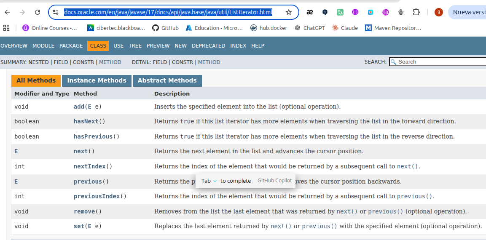

# Clase-4 : 🗂️🗂️ La interface Collection -  📚
# Clase-5 : 🗂️🗂️ Colecciones de Genericos-  📚

- La interface Collection es la raíz de la jerarquía de colecciones en Java.
- Proporciona métodos básicos para manipular colecciones, como agregar, eliminar 
- y verificar la presencia de elementos. Es una interfaz genérica que se puede 
- implementar con diferentes tipos de colecciones, como List, Set y Queue.

### Metodos -> 

Aquí está la información organizada en una tabla markdown con iconos:

| Método | Descripción |
|--------|-------------|
| ➕ `add()` | Agrega un elemento a la colección. Devuelve `true` si la colección cambió como resultado de la operación. |
| 🗑️ `clear()` | Elimina todos los elementos de la colección. |
| 🔍 `contains(Object o)` | Verifica si la colección contiene un elemento específico. Devuelve `true` si el elemento está presente. |
| 🔍 `containsAll(Collection<?> c)` | Verifica si la colección contiene todos los elementos de otra colección. Devuelve `true` si todos los elementos están presentes. |
| ⚖️ `equals(Object o)` | Compara la colección con otro objeto para determinar si son iguales. Devuelve `true` si ambos objetos son colecciones y contienen los mismos elementos. |
| #️⃣ `hashCode()` | Devuelve un código hash para la colección, que se puede usar en estructuras de datos basadas en hash. |
| ❓ `isEmpty()` | Verifica si la colección está vacía. Devuelve `true` si no contiene elementos. |
| 🔄 `iterator()` | Devuelve un iterador para recorrer los elementos de la colección. |
| ⚡ `parallelStream()` | Devuelve un Stream paralelo que contiene los elementos de la colección, lo que permite realizar operaciones de procesamiento en paralelo. |
| ➖ `remove(Object o)` | Elimina un elemento específico de la colección. Devuelve `true` si el elemento se eliminó correctamente. |
| ➖ `removeAll(Collection<?> c)` | Elimina todos los elementos de la colección que también están presentes en otra colección. Devuelve `true` si la colección cambió como resultado de la operación. |
| 🎯 `removeIf(Predicate<? super E> filter)` | Elimina todos los elementos de la colección que satisfacen el predicado dado. Devuelve `true` si se eliminó al menos un elemento. |
| 🔒 `retainAll(Collection<?> c)` | Conserva solo los elementos de la colección que también están presentes en otra colección. Devuelve `true` si la colección cambió como resultado de la operación. |
| 📊 `size()` | Devuelve el número de elementos en la colección. |
| ✂️ `spliterator()` | Devuelve un Spliterator para la colección, que se puede usar para recorrer los elementos de manera eficiente. |
| 🌊 `stream()` | Devuelve un Stream que contiene los elementos de la colección, lo que permite realizar operaciones de procesamiento en paralelo o secuencial. |
| 📦 `toArray()` | Devuelve un array que contiene todos los elementos de la colección. El tipo del array es `Object[]`. |
| 📦 `toArray(T[] a)` | Devuelve un array que contiene todos los elementos de la colección. Si el array proporcionado es lo suficientemente grande, se utiliza para almacenar los elementos; de lo contrario, se crea un nuevo array del mismo tipo. |

---

# Clase-6 : 🗂️🗂️ Interfaz List-  📚
- La interfaz List es una subinterfaz de Collection que representa una colección ordenada de elementos. Permite elementos duplicados y proporciona métodos específicos para trabajar con listas, como acceder a elementos por índice, insertar elementos en posiciones específicas y buscar elementos.
- La interfaz List es ampliamente utilizada en Java para almacenar y manipular secuencias de elementos, como listas de nombres, números o cualquier otro tipo de datos. Algunas implementaciones comunes de la interfaz List incluyen ArrayList, LinkedList y Vector.
- Los métodos más comunes de la interfaz List incluyen metodos 
- se pueden repetir elementos, acceder a elementos por índice, insertar elementos en posiciones específicas y buscar elementos. Algunos de los métodos más comunes de la interfaz List incluyen:

- **ListIterator** : Es una interfaz que extiende Iterator y proporciona métodos adicionales para recorrer y modificar una lista. Permite iterar en ambas direcciones (hacia adelante y hacia atrás) y realizar operaciones de inserción, eliminación y reemplazo durante la iteración.
- **ArrayList** : Es una implementación de la interfaz List que utiliza un array dinámico para almacenar los elementos. Es eficiente para acceder a elementos por índice, pero puede ser menos eficiente para insertar o eliminar elementos en posiciones específicas debido a la necesidad de desplazar los elementos.
- **LinkedList** : Es otra implementación de la interfaz List que utiliza una estructura de datos de lista enlazada para almacenar los elementos. Es eficiente para insertar o eliminar elementos en posiciones específicas, pero puede

metodos ->
- **Set** : Es una interfaz que representa una colección que no permite elementos duplicados. No garantiza un orden específico de los elementos. Algunas implementaciones comunes de la interfaz Set incluyen HashSet, LinkedHashSet y TreeSet.
- **subList** : Es un método de la interfaz List que devuelve una vista de una parte de la lista original. Permite trabajar con una sección específica de la lista sin modificar la lista original. La sublista es dinámica, lo que significa que los cambios realizados en la sublista se reflejan en la lista original y viceversa.
- **ListOf** : Es un método estático introducido en Java 9 que permite crear una lista inmutable a partir de un número variable de elementos. La lista creada con List.of es inmutable, lo que significa que no se pueden agregar, eliminar o modificar elementos después de su creación. Es útil para crear listas de manera concisa y segura cuando no se requiere mutabilidad.

# Clase-8 : 🗂️🗂️ Creacion de ArrayList y adicion de elementos-  📚
https://docs.oracle.com/en/java/javase/17/docs/api/java.base/java/util/ArrayList.html#method-summary

```text
Sí, la clase ArrayList implementa la interfaz List en Java. Esto significa que ArrayList hereda todos los métodos definidos en la interfaz List, como add, remove, get, size, etc.
En tu archivo C_08_ArrayList1.java, cuando declaras:
List<String> listaColores = new ArrayList<>();
Estás usando la interfaz List como tipo de referencia, y ArrayList como la implementación concreta. Esto es una buena práctica porque permite cambiar fácilmente la implementación (por ejemplo, a LinkedList) sin modificar el resto del código.
¿Quieres que agregue un comentario explicativo en tu archivo para aclarar este punto, o necesitas ejemplos de métodos de la interfaz List usados con ArrayList?
```

# Clase-9 : 🗂️🗂️ METODO DE INTERACION EN LAS LISTAS-  📚

# ¿ que es el metodo Iterator?
rpta : El método `iterator()` es un método definido en la interfaz Collection que devuelve un objeto de tipo Iterator. 
Un Iterator es una interfaz que proporciona métodos para recorrer los elementos de una colección de manera secuencial. 
Permite acceder a los elementos de la colección sin exponer su estructura interna.

https://docs.oracle.com/en/java/javase/17/docs/api/java.base/java/util/Iterator.html

https://docs.oracle.com/en/java/javase/17/docs/api/java.base/java/util/ListIterator.html



# 🔄 Iterator y ListIterator en Java - Explicación completa

## 🎯 ¿Qué es Iterator?

### 📖 Definición

`Iterator` es una **interfaz** (NO un método) que pertenece al paquete `java.util`.

```java
public interface Iterator<E> {
    boolean hasNext();
    E next();
    void remove();
}
```

### 🏗️ Jerarquía

```
Collection (interfaz)
    ↓
    └─ iterator() (método que retorna Iterator)
           ↓
       Iterator<E> (interfaz)
```

---

## 🔍 Iterator vs ListIterator - Diferencias

### 📊 Tabla comparativa

| Característica | Iterator | ListIterator |
|----------------|----------|--------------|
| **Tipo** | Interfaz básica | Interfaz extendida (hereda de Iterator) |
| **Dirección** | ⏩ Solo hacia adelante | ⏩⏪ Adelante y atrás |
| **Funciona con** | Cualquier Collection | Solo con List |
| **Métodos básicos** | `hasNext()`, `next()`, `remove()` | Todo lo de Iterator + más |
| **Índices** | ❌ No maneja índices | ✅ Sí (`nextIndex()`, `previousIndex()`) |
| **Modificación** | Solo eliminar | Eliminar, agregar, reemplazar |

---

### 🎨 Visualización de la jerarquía

```
Iterator<E> (interfaz padre)
    ├─ boolean hasNext()
    ├─ E next()
    └─ void remove()
           ↑
           │ extiende
           │
ListIterator<E> (interfaz hija)
    ├─ Todo lo de Iterator +
    ├─ boolean hasPrevious()
    ├─ E previous()
    ├─ int nextIndex()
    ├─ int previousIndex()
    ├─ void set(E e)
    └─ void add(E e)
```

---

## 🔧 Métodos de Iterator

### 📋 Iterator (básico)

```java
Iterator<String> iterator = lista.iterator();

// Métodos disponibles:
iterator.hasNext()   // ¿Hay siguiente elemento?
iterator.next()      // Obtiene el siguiente elemento
iterator.remove()    // Elimina el elemento actual
```

### 📋 ListIterator (avanzado)

```java
ListIterator<String> listIterator = lista.listIterator();

// Métodos adicionales:
listIterator.hasPrevious()     // ¿Hay elemento anterior?
listIterator.previous()        // Obtiene elemento anterior
listIterator.nextIndex()       // Índice del siguiente
listIterator.previousIndex()   // Índice del anterior
listIterator.set("nuevo")      // Reemplaza elemento actual
listIterator.add("nuevo")      // Agrega elemento
```

---

## 🎯 ¿Cuál es el propósito de cada uno?

### 🔹 Iterator - Recorrido básico

**Propósito**: Recorrer **cualquier colección** de forma secuencial hacia adelante.

```java
List<String> lista = Arrays.asList("A", "B", "C");
Iterator<String> iterator = lista.iterator();

// Solo puedes ir hacia adelante ⏩
while (iterator.hasNext()) {
    System.out.println(iterator.next());
}
```

**Salida:**
```
A
B
C
```

---

### 🔹 ListIterator - Recorrido bidireccional

**Propósito**: Recorrer **listas** en ambas direcciones y modificarlas durante el recorrido.

```java
List<String> lista = new ArrayList<>(Arrays.asList("A", "B", "C"));
ListIterator<String> listIterator = lista.listIterator();

// Ir hacia adelante ⏩
while (listIterator.hasNext()) {
    System.out.println(listIterator.next());
}

// Ir hacia atrás ⏪
while (listIterator.hasPrevious()) {
    System.out.println(listIterator.previous());
}
```

**Salida:**
```
A
B
C
C
B
A
```

---

## 🔄 ¿Cómo funciona internamente el Iterator?

### 📍 Concepto del cursor

El iterator funciona como un **cursor** que apunta entre elementos:

```
Lista: ["Rojo", "Verde", "Azul"]

Estado inicial:
    ↓ cursor
    ["Rojo", "Verde", "Azul"]

Después de next():
    ["Rojo", ↓ "Verde", "Azul"]
              cursor

Después de next():
    ["Rojo", "Verde", ↓ "Azul"]
                      cursor
```

---

### 🎬 Flujo paso a paso

```java
List<String> listaColores = Arrays.asList("Rojo", "Verde", "Azul");
ListIterator<String> iterador = listaColores.listIterator();
```

#### Estado 1: Inicialización

```
Cursor: ↓
Lista:  ["Rojo", "Verde", "Azul"]
         ^
         |
    hasNext() = true (hay elemento después del cursor)
```

#### Estado 2: Primera llamada a next()

```java
iterador.hasNext(); // true
String color = iterador.next(); // "Rojo"
```

```
Cursor:        ↓
Lista:  ["Rojo", "Verde", "Azul"]
                 ^
                 |
    Retorna "Rojo" y mueve el cursor
    hasNext() = true
```

#### Estado 3: Segunda llamada a next()

```java
iterador.hasNext(); // true
String color = iterador.next(); // "Verde"
```

```
Cursor:               ↓
Lista:  ["Rojo", "Verde", "Azul"]
                        ^
                        |
    Retorna "Verde" y mueve el cursor
    hasNext() = true
```

#### Estado 4: Tercera llamada a next()

```java
iterador.hasNext(); // true
String color = iterador.next(); // "Azul"
```

```
Cursor:                      ↓
Lista:  ["Rojo", "Verde", "Azul"]
    
    Retorna "Azul" y mueve el cursor
    hasNext() = false (no hay más elementos)
```

---

## 🤔 ¿Por qué se usa `iterator.next()` en la impresión?

### ❌ Forma incorrecta (no funciona)

```java
while (iterador.hasNext()) {
    System.out.println("Color:" + iterador); // ❌ Imprime el objeto Iterator, no el elemento
}
```

**Salida incorrecta:**
```
Color:java.util.ArrayList$ListItr@15db9742
Color:java.util.ArrayList$ListItr@15db9742
Color:java.util.ArrayList$ListItr@15db9742
```

---

### ✅ Forma correcta

```java
while (iterador.hasNext()) {
    System.out.println("Color:" + iterador.next()); // ✅ Obtiene Y avanza al siguiente
}
```

**Salida correcta:**
```
Color:Rojo
Color:Verde
Color:Azul
```

---

### 🔍 ¿Por qué next() hace dos cosas?

El método `next()` hace **DOS operaciones atómicas**:

1. **Retorna** el elemento actual
2. **Mueve** el cursor al siguiente

```java
public E next() {
    E elemento = obtenerElementoActual();  // 1. Obtener
    moverCursor();                          // 2. Avanzar
    return elemento;                        // Retornar
}
```

---

## 💻 Ejemplos prácticos completos

### 🔹 Ejemplo 1: Iterator básico

```java
import java.util.*;

public class EjemploIterator {
    public static void main(String[] args) {
        List<String> colores = Arrays.asList("Rojo", "Verde", "Azul");
        
        // Crear iterator
        Iterator<String> iterator = colores.iterator();
        
        // Recorrer
        while (iterator.hasNext()) {
            String color = iterator.next();
            System.out.println("Color: " + color);
        }
    }
}
```

**Salida:**
```
Color: Rojo
Color: Verde
Color: Azul
```

---

### 🔹 Ejemplo 2: ListIterator bidireccional

```java
import java.util.*;

public class EjemploListIterator {
    public static void main(String[] args) {
        List<String> colores = Arrays.asList("Rojo", "Verde", "Azul");
        
        // Crear list iterator
        ListIterator<String> listIterator = colores.listIterator();
        
        // Hacia adelante ⏩
        System.out.println("=== Hacia adelante ===");
        while (listIterator.hasNext()) {
            System.out.println(listIterator.next());
        }
        
        // Hacia atrás ⏪
        System.out.println("\n=== Hacia atrás ===");
        while (listIterator.hasPrevious()) {
            System.out.println(listIterator.previous());
        }
    }
}
```

**Salida:**
```
=== Hacia adelante ===
Rojo
Verde
Azul

=== Hacia atrás ===
Azul
Verde
Rojo
```

---

### 🔹 Ejemplo 3: Modificar durante iteración

```java
import java.util.*;

public class EjemploModificar {
    public static void main(String[] args) {
        List<String> colores = new ArrayList<>(Arrays.asList("Rojo", "Verde", "Azul"));
        
        ListIterator<String> listIterator = colores.listIterator();
        
        while (listIterator.hasNext()) {
            String color = listIterator.next();
            
            // Modificar elemento actual
            if (color.equals("Verde")) {
                listIterator.set("Verde Oscuro");
            }
            
            // Agregar después del elemento actual
            if (color.equals("Azul")) {
                listIterator.add("Amarillo");
            }
        }
        
        System.out.println("Lista modificada: " + colores);
    }
}
```

**Salida:**
```
Lista modificada: [Rojo, Verde Oscuro, Azul, Amarillo]
```

---

### 🔹 Ejemplo 4: Eliminar durante iteración

```java
import java.util.*;

public class EjemploEliminar {
    public static void main(String[] args) {
        List<String> colores = new ArrayList<>(Arrays.asList("Rojo", "Verde", "Azul", "Amarillo"));
        
        Iterator<String> iterator = colores.iterator();
        
        while (iterator.hasNext()) {
            String color = iterator.next();
            
            // Eliminar colores que empiezan con "A"
            if (color.startsWith("A")) {
                iterator.remove(); // ✅ Forma segura de eliminar
            }
        }
        
        System.out.println("Lista después de eliminar: " + colores);
    }
}
```

**Salida:**
```
Lista después de eliminar: [Rojo, Verde]
```

---

## ⚠️ Errores comunes

### ❌ Error 1: Llamar next() sin verificar hasNext()

```java
Iterator<String> iterator = lista.iterator();
iterator.next(); // ✅ OK
iterator.next(); // ✅ OK
iterator.next(); // ✅ OK
iterator.next(); // ❌ NoSuchElementException (no hay más elementos)
```

**Solución:**
```java
while (iterator.hasNext()) { // Siempre verificar primero
    System.out.println(iterator.next());
}
```

---

### ❌ Error 2: Modificar colección durante iteración (sin iterator)

```java
List<String> lista = new ArrayList<>(Arrays.asList("A", "B", "C"));
Iterator<String> iterator = lista.iterator();

while (iterator.hasNext()) {
    String elemento = iterator.next();
    lista.remove(elemento); // ❌ ConcurrentModificationException
}
```

**Solución:**
```java
while (iterator.hasNext()) {
    iterator.next();
    iterator.remove(); // ✅ Usar el método remove() del iterator
}
```

---

### ❌ Error 3: Llamar next() dos veces en el mismo ciclo

```java
while (iterator.hasNext()) {
    System.out.println(iterator.next()); // Imprime "Rojo"
    System.out.println(iterator.next()); // Imprime "Verde" (saltó un elemento)
}
```

**Solución:**
```java
while (iterator.hasNext()) {
    String elemento = iterator.next(); // Guardarlo en variable
    System.out.println(elemento);
    System.out.println(elemento); // Usar la variable
}
```

---

## 🎯 Análisis de tu código

```java
ListIterator<String> iterador = listaColores.listIterator();
System.out.println("Recorrido con iterador :");
while (iterador.hasNext()) {
    System.out.println("Color:" + iterador.next());
}
```

### 🔍 Desglose línea por línea

#### Línea 1:
```java
ListIterator<String> iterador = listaColores.listIterator();
```

- Crea un **ListIterator** para la lista
- El cursor se posiciona **antes del primer elemento**
- `ListIterator<String>` significa que iterará sobre elementos de tipo String

#### Línea 2:
```java
System.out.println("Recorrido con iterador :");
```

- Imprime un encabezado (esto es solo texto)

#### Línea 3:
```java
while (iterador.hasNext()) {
```

- Pregunta: "¿Hay un elemento siguiente?"
- Si **true**: ejecuta el bloque
- Si **false**: sale del while

#### Línea 4:
```java
System.out.println("Color:" + iterador.next());
```

- `iterador.next()`:
    1. **Obtiene** el elemento actual
    2. **Mueve** el cursor al siguiente
    3. **Retorna** el elemento obtenido
- `System.out.println()`: Imprime el resultado

---

### 🎬 Ejecución paso a paso

Supongamos: `listaColores = ["Rojo", "Verde", "Azul"]`

```
Iteración 1:
    hasNext() → true
    next() → "Rojo"
    Imprime: "Color:Rojo"
    
Iteración 2:
    hasNext() → true
    next() → "Verde"
    Imprime: "Color:Verde"
    
Iteración 3:
    hasNext() → true
    next() → "Azul"
    Imprime: "Color:Azul"
    
Iteración 4:
    hasNext() → false
    Sale del while
```

---

## 📚 Cuándo usar cada uno

### 🔹 Usa Iterator cuando:

- ✅ Solo necesitas recorrer hacia adelante
- ✅ Trabajas con cualquier Collection (Set, Queue, List)
- ✅ Solo necesitas leer o eliminar elementos

```java
Set<String> set = new HashSet<>(Arrays.asList("A", "B", "C"));
Iterator<String> iterator = set.iterator(); // Set NO tiene ListIterator
```

---

### 🔹 Usa ListIterator cuando:

- ✅ Trabajas específicamente con **List**
- ✅ Necesitas recorrer en **ambas direcciones**
- ✅ Necesitas **modificar** elementos durante la iteración
- ✅ Necesitas saber el **índice** actual

```java
List<String> lista = new ArrayList<>(Arrays.asList("A", "B", "C"));
ListIterator<String> listIterator = lista.listIterator();
```

---

## 🎓 Resumen final

### 🔑 Conceptos clave

| Concepto | Explicación |
|----------|-------------|
| **Iterator** | Interfaz para recorrer colecciones hacia adelante |
| **ListIterator** | Interfaz extendida, solo para List, bidireccional |
| **Cursor** | Posición actual del iterator entre elementos |
| **hasNext()** | Verifica si hay siguiente elemento |
| **next()** | Obtiene elemento actual Y mueve cursor |
| **previous()** | (Solo ListIterator) Retrocede y obtiene elemento |
| **remove()** | Elimina el último elemento retornado por next() |

---

### ✅ Por qué `iterator.next()` se usa en la impresión

1. **`next()` retorna el elemento** - No solo mueve el cursor
2. **Es la única forma de obtener el valor** - El iterator en sí no es el elemento
3. **Combina obtención + avance** - Eficiente en una sola llamada

---

### 🎯 Forma mental de recordarlo

```
Iterator = Control remoto 📺
    - hasNext() = ¿Hay siguiente canal?
    - next() = Cambiar al siguiente canal Y mostrarlo
    
ListIterator = Control remoto con botón atrás ⏮️⏭️
    - hasPrevious() = ¿Hay canal anterior?
    - previous() = Cambiar al canal anterior Y mostrarlo
```

¿Te quedó claro o quieres que profundice en algún aspecto específico?


